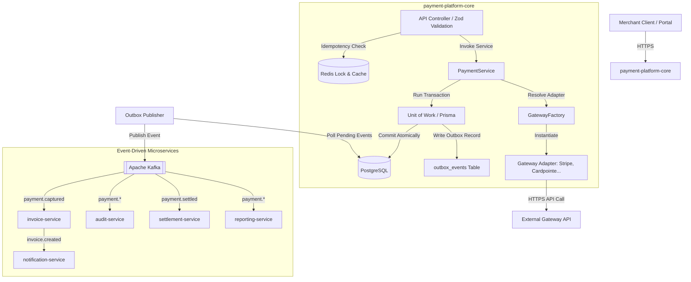

# Systems Architecture & Component Topology

This document details the architectural boundaries, container scopes, shared library design, transaction boundaries, and design patterns that govern the Payment Orchestration Platform.

---

## 1. Monorepo Architecture Overview

The platform uses a **Modular Monolith** for core payment transactions and **Event-Driven Services** for secondary, asynchronous concerns. A root-level shared library serves as the single source of truth for cross-cutting code.

```
payment-orchestration-platform/
│
├── shared/                    ← Single source of truth for all shared code
│   ├── constants/             ← Enums (payment statuses, Kafka topics, gateway codes)
│   ├── contracts/             ← AbstractPaymentGateway base contract class
│   ├── crypto/                ← AES-256-GCM encryption/decryption
│   ├── dates/                 ← Date formatting & timezone utilities
│   ├── dto/                   ← Standardized request/response DTOs
│   ├── errors/                ← Custom AppError hierarchy
│   ├── events/                ← Typed Kafka event contracts
│   ├── ids/                   ← UUIDv7 time-sortable ID generator
│   ├── logger/                ← createLogger(name) Pino logger factory
│   └── validators/            ← Zod schemas for validation
│
├── payment-platform-core/     ← Modular Monolith (Express, Prisma, PostgreSQL, Redis)
├── services/                  ← Event-Driven Microservices (asynchronous workers)
│   ├── audit-service/         ← Compliance audit logger
│   ├── invoice-service/       ← PDF invoice generator
│   ├── notification-service/  ← Email/SMS dispatcher
│   ├── reporting-service/     ← Analytics aggregation service
│   └── settlement-service/    ← Bank payout reconciliation engine
│
├── payment-platform-portal/   ← Next.js 15 Merchant & Developer Web Dashboard
│   ├── app/lib/
│   │   ├── api.ts             ← Axios client + handleApiError() central error router
│   │   └── messages.ts        ← Centralized message registry (single source of truth for UI strings)
│   └── components/
│       ├── notification/      ← Singleton NotificationService + React NotificationProvider + Toast UI
│       └── validation/        ← useFormValidation + ValidationField + InputErrorState (inline only)
│
└── payment-platform-sdk/      ← Node.js Client SDK (standalone integration library)
```

### Non-Negotiable Architecture Rules
- **No Direct Gateway Calls**: All core business services must interact with payment gateways through the Gateway Abstraction Layer.
- **Pino Logger Factory**: Every logger instance must be created using `createLogger(name)` from `@shared/logger/create-logger`.
- **UUIDv7 standard**: All entity IDs must be generated using `generateUuidV7()` from `@shared/ids/generate-uuid-v7`.
- **Strict Code Sharing**: Shared utilities, constants, validators, errors, and DTOs must live only in `@shared/` and must be imported via paths mapped to `@shared/*`. No duplications are permitted.
- **Frontend Presentation Layer**: The frontend must use the central `DataTable` framework (`@components/datatable`) and `ActionRegistry` (`@components/actions`) for all listings. Page-specific tables or actions are strictly prohibited.
- **Frontend Message Registry**: All user-facing strings (validation messages, success/error copy, toast messages) must be sourced from `app/lib/messages.ts`. Hardcoded strings in components or Zod schemas are prohibited.
- **Frontend Notification System**: All user-facing success, error, warning, and info feedback must go through `@components/notification`. Direct `alert()`, `console.error()`, or custom toast implementations are prohibited.
- **Frontend Error Routing**: All API `catch` blocks must delegate to `handleApiError()` from `@/lib/api`. Field-specific server errors are mapped inline; system errors are shown as toasts. Custom per-page error routing logic is prohibited.

---

## 2. Core Architectural Patterns



### 2.6 Transaction Lifecycle and Merchant-Facing Records

Merchant-facing transaction management is represented by the `payments` table. Ledger rows in `transactions` remain accounting records and are not displayed as separate merchant transactions.

AUTH to CAPTURE handling updates the original payment record from `AUTHORIZED` to `CAPTURED`; it does not create a second merchant-facing transaction. This preserves one visible transaction ID across authorization, capture, void, and refund workflows.

Every lifecycle transition writes an immutable row to `transaction_events` in the same database transaction as the payment status update. Receipt and details pages render their timeline from `transaction_events` rather than reconstructing history from the current payment status.

Action eligibility is centralized in `shared/transactions/transaction-lifecycle.ts` and consumed by both the core API and the portal:

| Status | Eligible Actions |
|---|---|
| `AUTHORIZED` | View Receipt, Capture, Void, Print Receipt |
| `CAPTURED` | View Receipt, Refund, Print Receipt |
| `REFUNDED` | View Receipt, Print Receipt |
| `VOIDED` | View Receipt, Print Receipt |
| `FAILED` | View Details |
| `PENDING` | View Details |

### 2.1 Repository & Unit of Work (UoW) Patterns
To guarantee database consistency and transaction integrity, the core engine isolates database operations behind the Repository and Unit of Work patterns:
- **Repositories**: Standardize queries and updates per entity (e.g., `PaymentRepository`, `PaymentAttemptRepository`, `OutboxEventRepository`).
- **Unit of Work**: Groups multiple repository operations inside a single, atomic PostgreSQL transaction. This guarantees that payments, attempts, ledger transactions, and outbox event records are committed atomically or rolled back completely.
- **Optimistic Locking**: The `payments` table contains a `version` column. Any concurrent updates check the version to prevent race conditions during state transitions.

### 2.2 Gateway Factory & Adapter Patterns
- **Adapter Pattern**: Standardizes diverse gateway protocols and payload shapes (e.g., Stripe's JSON API, Cardpointe's plain REST with Basic Auth, Authorize.Net's SDK, NMI's key-value query parameters) under a single contract (`AbstractPaymentGateway`).
- **Gateway Factory**: Dynamically instantiates the correct adapter at runtime. It queries the `merchant_gateway_configurations` table, decrypts the credentials via AES-256-GCM (`credentialEncryptionService`), and registers the adapter based on the provider code (e.g. `STRIPE`, `CARDPOINTE`, `AUTHORIZE_NET`, `NMI`).

### 2.3 Circuit Breaker Pattern (Opossum)
- **Problem**: Remote gateway API calls can slow down or time out, which consumes core server thread pools and degrades system performance.
- **Solution**: The platform wraps gateway adapter method invocations inside an Opossum circuit breaker.
- **Tripping Logic**: If consecutive calls to a specific gateway fail or time out (threshold default: 3 failures), the circuit trips to `OPEN`. In this state, subsequent traffic immediately fails fast, bypassing the broken network adapter.
- **Self-Healing**: After a cooldown window (default: 30 seconds), the circuit transitions to `HALF_OPEN`, sending a single request to test the gateway's health. If successful, the circuit resets to `CLOSED`. If it fails, it returns to `OPEN`.

### 2.4 Transactional Outbox Pattern
- **Problem**: Publishing events directly to Kafka during a database transaction violates atomicity. If Kafka is down, the transaction fails. If the transaction rolls back after the event is published, downstream services act on phantom data.
- **Solution**: Events are stored as rows in the `outbox_events` table within the same database transaction as the payment record.
- **Delivery Guarantee**: An independent polling worker (`OutboxPublisher`) runs in the background. It reads `PENDING` events, publishes them to Kafka, and marks them as `PUBLISHED` upon acknowledgement. This guarantees **at-least-once** event delivery.

### 2.5 Saga Pattern (Choreographed Workflow)
Distributed transactions are managed using an event-driven, choreographed Saga pattern:
1. **Core Monolith**: Commits payment capture and writes a `payment.captured` event to the Outbox.
2. **Invoice Service**: Consumes `payment.captured`, generates a PDF invoice, uploads it to S3 (MinIO), and emits an `invoice.created` event.
3. **Notification Service**: Consumes `invoice.created`, sends the email invoice via SMTP, and emits a `notification.sent` event.
4. **Audit Service**: Consumes all payment events asynchronously and logs them in an immutable compliance ledger.
*Compensating Transactions*: If the invoice generation fails, the Invoice Service emits an `invoice.failed` event, prompting the system to trigger manual operations or automated payment reversal Sagas depending on the business rules.

---

## 3. Redis Caching & Idempotency Strategy

Redis 7 serves as the platform's high-speed distributed cache and locking coordinator:
- **Idempotency Keys**: Distributed locking prevents duplicate charges. When a POST request arrives with an `Idempotency-Key` header, the request is checked. If it is already processing or completed, the system blocks duplicates or returns the cached response.
- **Rate Limiting**: Protects public APIs by tracking client requests in a sliding window using Redis sorted sets.
- **Data Cache**: Stores static config tables (e.g., `gateway_providers`) to minimize database query overhead.

---

## 4. Kafka Event-Driven Communication

Apache Kafka serves as the broker for all asynchronous, non-blocking processes:
- **Topic Conventions**: Topics are named logically according to the entity and event type (e.g., `payment.captured`, `payment.failed`, `invoice.created`).
- **Consumer Groups**: Each microservice runs in its own consumer group. This allows independent scaling and offset tracking (e.g. `invoice-service-group`, `notification-service-group`).
- **Dead Letter Queue (DLQ)**: Failed events are automatically routed to a dedicated DLQ topic (e.g., `payment.captured.dlq`) with metadata detailing the failure. This prevents consumer threads from stalling while allowing engineers to inspect and replay poisoned payloads.

---

## 5. C4 Model Layout

### 5.1 C4 Level 1: System Context
```
┌─────────────────┐       HTTPS API        ┌─────────────────────────┐
│                 ├───────────────────────>│                         │
│  Merchant       │                        │   Payment Platform      │
│  Systems        │<───────────────────────┤   Orchestration Engine  │
│                 │      Webhook Call      │                         │
└─────────────────┘                        └────────────┬────────────┘
                                                        │
                                                        │ HTTPS Gateway API
                                                        ▼
                                           ┌─────────────────────────┐
                                           │  External Gateways      │
                                           │ (Stripe, Auth.Net, NMI, │
                                           │  Cardpointe REST API)   │
                                           └─────────────────────────┘
```

### 5.2 C4 Level 2: Container Topology

| Container | Technology | Port | Role |
|---|---|---|---|
| `payment-platform-core` | Express + Prisma | 3000 | Core transactional payment engine & outbox worker |
| `invoice-service` | Node.js + KafkaJS | 3001 | PDF invoice generator & S3 uploader |
| `notification-service` | Node.js + KafkaJS | 3002 | SMTP email and SMS dispatcher |
| `audit-service` | Node.js + KafkaJS | 3003 | Compliance auditor & event log manager |
| `settlement-service` | Node.js + Prisma | 3004 | Bank payout reconciliation manager |
| `reporting-service` | Express + Prisma | 3005 | Analytics aggregation & metrics engine |
| `payment-platform-portal` | Next.js 15 | 3006 | Merchant portal and developer dashboard |
| `postgres` | PostgreSQL 16 | 5432 | Primary ACID relational database |
| `redis` | Redis 7 | 6379 | Idempotency locking, rate-limiting, and cache |
| `kafka` | Confluent Kafka | 9092 | Async message broker & event hub |
| `mailhog` | MailHog | 8025 / 1025 | Local SMTP mock console & mail server |
| `minio` | MinIO | 9000 / 9001 | Local S3 object store & console |

---

## 6. Docker Build Architecture

To bundle the `shared/` directory (which is a local directory rather than an npm registry package) into container images, all Dockerfiles use a **multi-stage build pattern** context-mapped to the repository root:

```dockerfile
# Stage 1: Builder
FROM node:22-alpine AS builder
WORKDIR /app
COPY package*.json ./
COPY services/invoice-service/package*.json ./services/invoice-service/
RUN npm ci
COPY services/invoice-service/ ./services/invoice-service/
COPY shared/ ./shared                          # Copy shared code
COPY payment-platform-core/prisma ./prisma     # Generate Prisma client
RUN npx prisma generate
RUN npm run build --workspace=services/invoice-service

# Stage 2: Runner
FROM node:22-alpine AS runner
WORKDIR /app
COPY --from=builder /app/services/invoice-service/dist ./dist
COPY --from=builder /app/shared ./shared        # Required for relative paths at runtime
COPY --from=builder /app/node_modules ./node_modules
CMD ["node", "dist/index.js"]
```
This multi-stage pattern compiles TypeScript code cleanly while keeping production containers slim.
